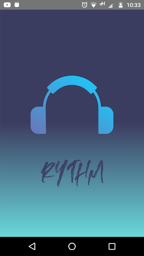
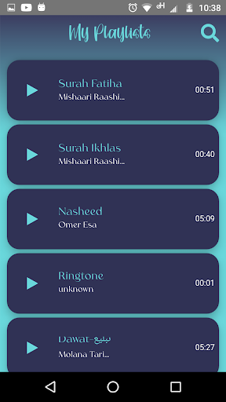

### Summary

The App will play sounds contained in the app.

### Working Result

<p align="center">


</p>

### Installation

First clone the app and run the command

```
npm install --save --legacy-peer-deps
```

and enjoy.
